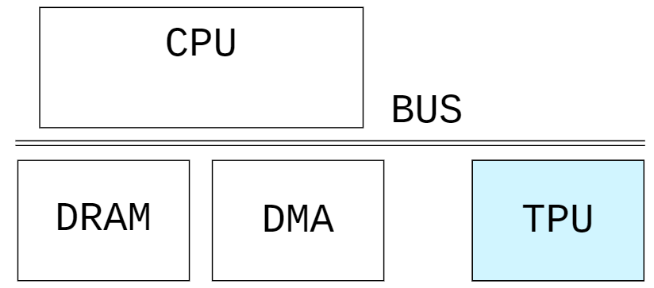
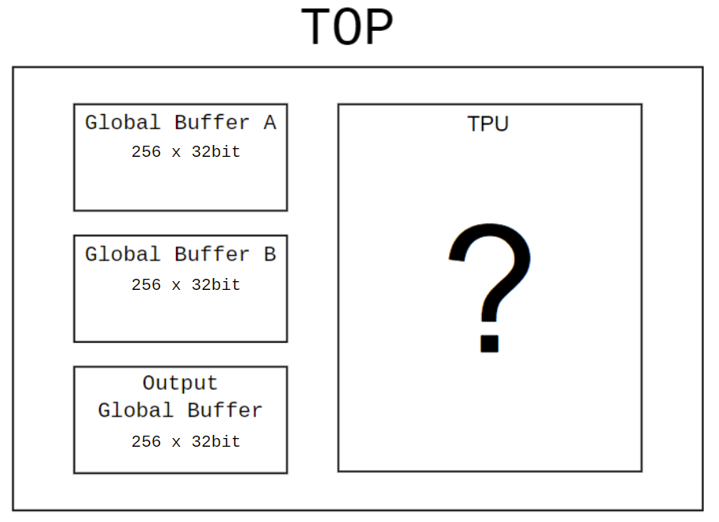
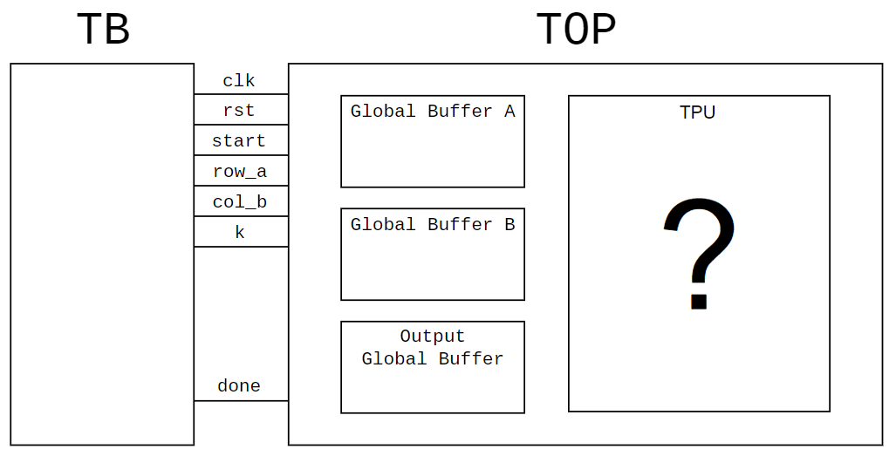
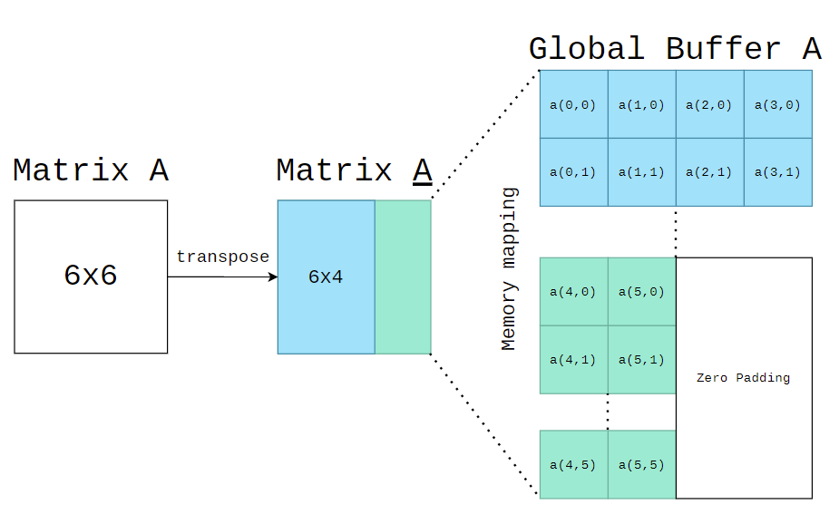

# AIC2021 Project1 - TPU
###### tags: `aic2021` 

## Project Description
Design a Tensor Processing Unit(TPU) which has **4x4** Processing elements(PEs) that is capable to calculate ```(4*K)*(K*4)``` 8-bit integer matrix muplication. (Where is ```K``` is limited by the size of input global buffer)

**Project Constraints**
1. Your designs should be written in verilog language.
2. Your PEs shouldn't more than **4x4**, where a 2D systolic array architecture is recommended.
3. An 8-bit data length design.
4. 3KiBytes in total of global buffer size.
 

* You should know that in real world, TPU is a Deep Learning Processor(DLP) on the common bus, data is prepared continously by CPU or DMA from DRAM.
* In this project, you should focus only on the design and dataflow inisde the TPU, instead of full system simulation including CPU, DMA, and DRAM (Make it simple :smile: unless you need more challange).

## Project directory hierachy
```
AIC2021_TPU/
    +-- tb/
    |   +-- matmul.py
    |   +-- top_tb.v
    +-- src/
    |   +-- define.v
    |   +-- global_buffer.v
    |   +-- top.v
    |
    Makefile
```

## TOP Simulation Achitecture


* Your TPU design should be under the top module which provided by TA.
* TOP module includes three global buffers prepared for your TPU. Each of the global buffers has its own read write port, ```256x32bit=1KiBytes``` size and result in total ```3KiBytes``` of global buffer.
* Although the global buffer is provided by TA, you are free to design your own global buffer's behavior, except the **name of the global buffers** which already defined in testbench in order to load the data & check the correctness of the output.


## Testbench

* At the start of the simulation, tb will load the global buffer A & B, which assume that CPU or DMA has already prepared the data for TPU in global buffer. When signal ```start==1```, the size of the two matrices will be available for TPU (```row_a```, ```col_b```, ```k```).
* You should implement your own data loader, process elements, and controller which schedule the data in global buffer to be calculated in the systolic array.
* Testbench will compare your output global buffer with golden, when you finish the calculation(```done==1```).

**Prerequisite**
* python3 with numpy library installed
* iverilog, ncverilog (or any other verilog compiler)

**Makefile**
* ```make test1```
    * ```A(2*2)*B(2*2)```
* ```make test2```
    * ```A(4*4)*B(4*4)```
* ```make test3```
    * ```A(4*K)*B(K*4)```, where ```K=9```
* ```make monster``` (extra)
    * ```A(M*K)*B(K*N)```, where ```K<10```, ```M<10```, ```N<10```
    * Although our target is ```(4*K)*(K*4)$``` matrix multiplication, when ```M``` & ```N``` is small enough to fit in the input global buffers, give a solution for that size of input matrices. :smile:
* ```make clean```
    * This will remove the ```build/``` folder 

**Global buffer mapping**
```
build/
    +-- matrix_a.bin
    +-- matrix_b.bin
    +-- golden.bin
```
* Memory Mapping - Type A (with transpose)

* Memory Mapping - Type B (Without transpose)

* As shown in the figure above, two figures give an example of ```A(6*6)*B(6*6)```, how is the memory mapping of 8-bit matrix data into 32-bit global buffer. Your output global buffer should follow the memory mapping - type B.

## Grading Scores
* Testbench1~3 (70%)
    * Designs of dataflow in TPU
    * Execution time ranking in class
    * Data reuse method 
    * Pass atleast test1~3
* Readme (20%)
    * **Members' Student ID**
    * TPU achitecture graph
    * Explain your dataflow in TPU
    * ...
* Extra (10%)
    * Support ```(M*K)*(K*N)```
    * or other features
        * please provided you own testbench for the extra features
